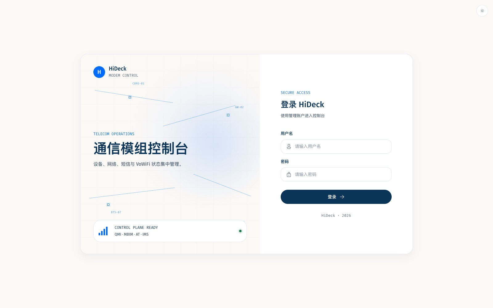
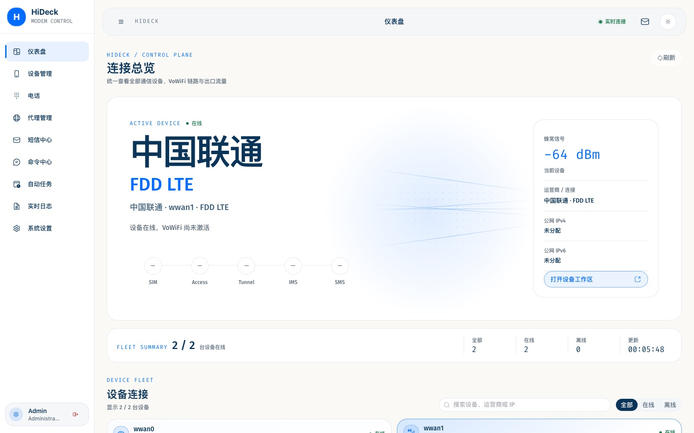
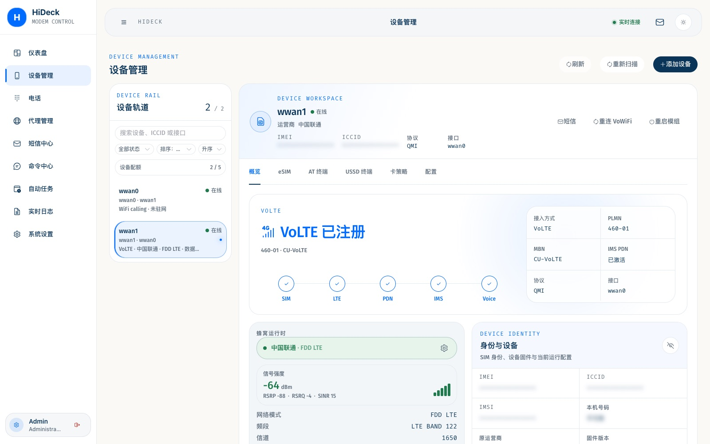
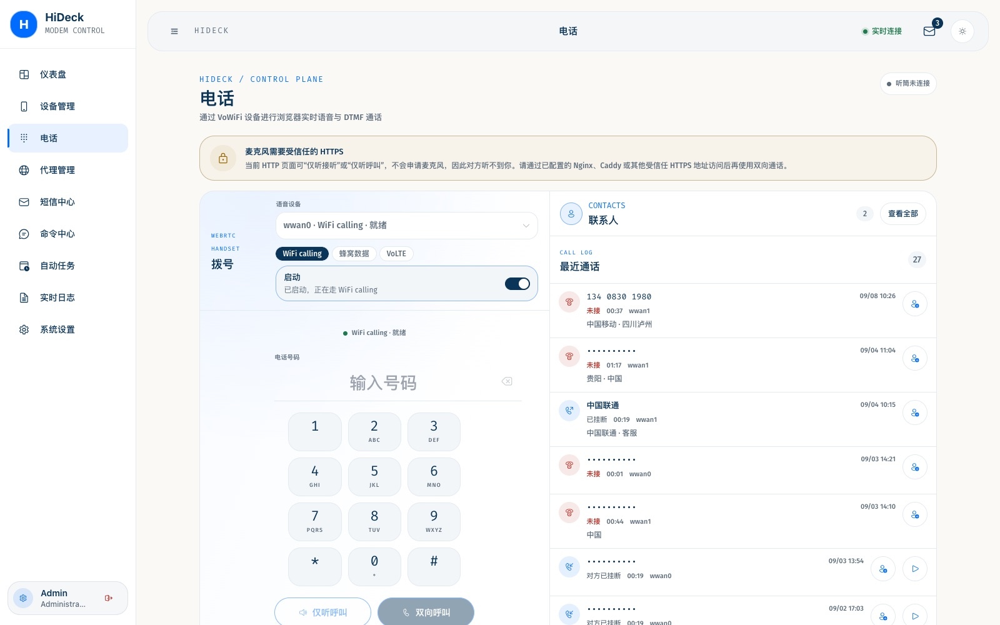
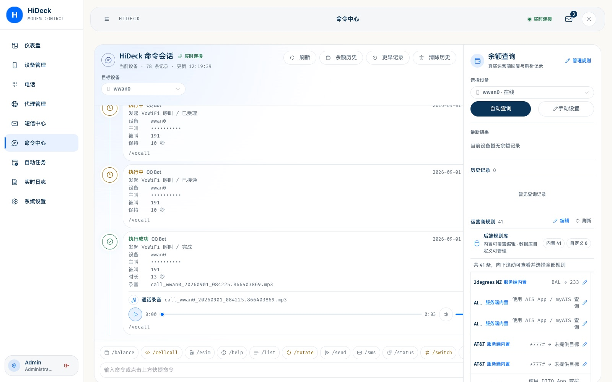
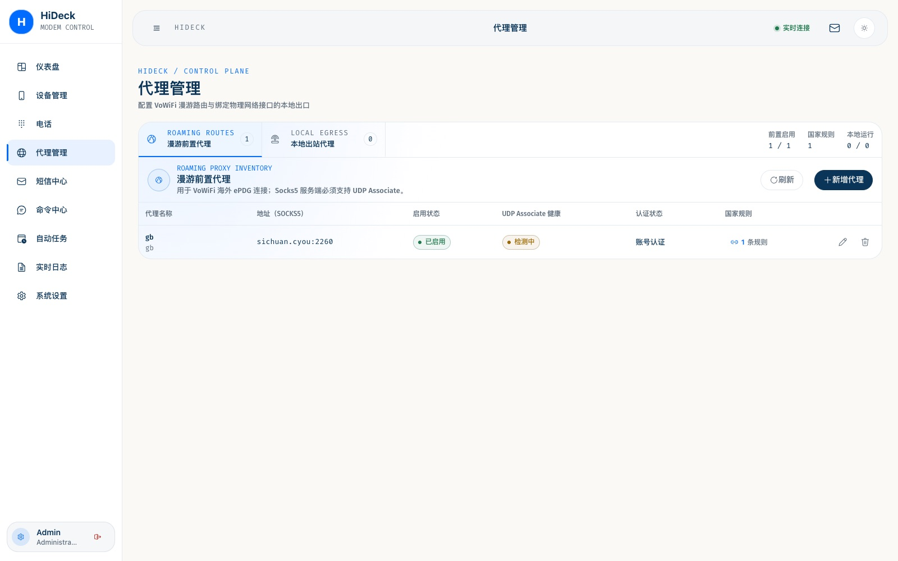

# HiDeck

[](https://polyformproject.org/licenses/noncommercial/1.0.0)
[](go.mod)
[](web/package.json)

HiDeck 是面向高通 4G/LTE/5G 模组的综合管理平台，将设备热插拔、移动网络代理、短信、VoWiFi/IMS 通话、eSIM 和自动任务整合在一个响应式 Web 控制台中。

- 项目仓库：[github.com/yibaiba/hideck](https://github.com/yibaiba/hideck)
- 默认 Web 端口：`7575`
- 默认账号：`admin` / `admin`
- 数据库：SQLite，默认路径 `data/hideck.db`

> 首次使用默认或弱密码登录后，HiDeck 会提示立即修改，可直接在提示页面完成。

## 界面预览

登录页与控制台主界面：





| 设备管理 | 电话 |
| --- | --- |
|  |  |

| 命令中心 | 代理管理 |
| --- | --- |
|  |  |

## 快速导航

- [界面预览](#界面预览)
- [核心能力](#核心能力)
- [电话与 eSIM](#电话与-esim)
- [Docker 部署（推荐）](#docker-部署推荐)
- [二进制部署](#二进制部署)
- [配置](#配置)
- [源码构建](#源码构建)
- [开发与验证](#开发与验证)
- [模组硬件](#模组硬件)
- [感谢](#感谢)
- [使用与许可](#使用与许可)

## 核心能力

| 模块 | 能力 |
| --- | --- |
| 设备管理 | 自动发现 USB 模组，管理 QMI、MBIM、AT 与 PC/SC 后端，实时展示设备和网络状态 |
| 移动代理 | 为指定数据网卡创建 SOCKS5 / HTTP 出口，并通过 `SO_BINDTODEVICE` 绑定流量 |
| 短信与命令 | 收发短信、管理联系人和会话、执行 AT/USSD 命令、查询余额并保存历史 |
| 电话 | WiFi calling、蜂窝软件 IMS、原生 VoLTE；保持/恢复、呼叫等待、仅听接听；对端挂断后停振铃 |
| VoWiFi / IMS | 建立 SWu/IMS 连接，处理短信与通话，并保存通话记录和录音；规范映射见 [VoWiFi 协议对齐](docs/vowifi-protocol-alignment.md) |
| 原生 VoLTE | `phone_mode=volte` 走模组 IMS / QMI VOICE；国内卡有唯一画像才选；不可用 USB 声卡会跳过以免打挂 QMI。见 [docs/volte-native.md](docs/volte-native.md) |
| eSIM | 下载、启用、停用、重命名、删除；可贴激活码或拖入二维码 / PDF 安装；Lebara UK `204/04` 污染可自动清污，不必删卡 |
| 自动任务 | 按设备、Profile、时区和计划执行任务，记录运行历史和错误 |
| 通知 | 支持 Telegram、Email、PushPlus、Bark、飞书、企业微信、微信和 QQ 等渠道 |
| 多架构交付 | 支持 Linux amd64、arm64 与 armv7 构建及 Docker 部署 |

## 电话与 eSIM

电话页可选 **WiFi calling**、**蜂窝数据** 或 **VoLTE**。接通后可保持/恢复；第二路来电显示呼叫等待；对端挂断后振铃会停。接听可选麦克风或仅听（对方听不到你）。

**原生 VoLTE**（`phone_mode=volte`）走模组 IMS，不建 ePDG。国内有唯一 MBN 画像的卡（移动 / 联通 / 电信 / 广电）才会选；英国等没有唯一画像时不会乱选，也不会回退软件 IMS。大疆/佰旺一类 USB 声卡不能开的模组会跳过声卡，避免把同口 QMI 打挂，信令仍可打。细节见 [原生 VoLTE](docs/volte-native.md)。

**Lebara UK** 分享卡运行时锁射频：不要关飞行或开流量驻国内网，否则 IMSI 会切到荷兰 `20404`，英国 WiFi calling 会废。切过去之后不必删卡重写——同一 ICCID 做一次停用/启用（或经停车 Profile 中转），连续读到英国 `23487` 后再开 VoWiFi。电话页会显示「正在恢复英国身份」。说明见 [运营商笔记](docs/operator-notes.md)。

**eSIM** 支持下载、启用、停用、重命名和删除，也可贴 `LPA:1$` 激活码，或拖入二维码图片 / PDF 安装。

## Docker 部署（推荐）

优先用 Docker。镜像已内置通话录音需要的 AMR / MP3 编解码库，不用再往宿主机装依赖。

运行环境需要 Linux、curl、Docker Engine、Docker Compose、host 网络和 USB 设备访问权限。
服务器使用 `docker-compose.yml` 拉取发布镜像。发版把已经打好的二进制拷进运行时底包（`docker-compose.build.yml`）；更新依赖或从源码完整构建用原来的 `Dockerfile` 和 `docker-compose.source.yml`。说明见 [DOCKERHUB.md](DOCKERHUB.md)。

服务器可直接通过 curl 安装到当前目录下的 `hideck/`：

```bash
curl -fsSL https://raw.githubusercontent.com/yibaiba/hideck/main/deploy.sh | sh
```

自定义安装目录：

```bash
curl -fsSL https://raw.githubusercontent.com/yibaiba/hideck/main/deploy.sh | HIDECK_DIR=/opt/hideck sh
```

使用公网域名前，先将域名的 `A` 或 `AAAA` 记录指向服务器，并在防火墙或 NAT 中同时放行 `443/TCP` 和 `443/UDP`。默认让 HTTPS 和 WebRTC 共用 `443` 端口：

```bash
curl -fsSL https://raw.githubusercontent.com/yibaiba/hideck/main/deploy.sh | \
  HIDECK_DOMAIN=hideck.example.com \
  HIDECK_DIR=/opt/hideck sh
```

`HIDECK_DOMAIN` 启用 `docker-compose.caddy.yml`。Caddy 使用 `443/TCP`，WebRTC 使用 `443/UDP`；Caddy 会关闭 HTTP/3，避免占用同一个 UDP 端口。部署脚本会生成权限为 `0600` 的 `caddy.env` 和 `hideck-caddy.env`，并让 WebRTC 从同一域名解析公网 ICE 地址。使用 DNS-01 时，`caddy.env` 还会保存 DNS 服务商凭证。再次传入 `HIDECK_DOMAIN` 会重新生成这两个环境文件。

公网不能使用 `80/443` 时，可以改用自定义端口和 DNS-01。以下示例使用 Cloudflare，在 `8443/TCP` 提供 HTTPS，并在 `8443/UDP` 提供 WebRTC：

```bash
curl -fsSL https://raw.githubusercontent.com/yibaiba/hideck/main/deploy.sh | \
  HIDECK_DOMAIN=hideck.example.com \
  HIDECK_HTTPS_PORT=8443 \
  HIDECK_DNS_PROVIDER=cloudflare \
  CLOUDFLARE_API_TOKEN=your_token \
  HIDECK_DIR=/opt/hideck sh
```

部署完成后通过 `https://hideck.example.com:8443` 访问。

`deploy.sh` 会下载部署所需的 Compose 和配置模板，在首次运行时生成 `config/config.yaml`，创建持久化目录，拉取 `latest` 并启动容器。已有 Compose、Caddy 模板和 `config/config.yaml` 会保留；上文所述的 Caddy 环境文件属于自动生成文件。在源码项目目录内也可以直接执行 `./deploy.sh`。

浏览器打开：

```text
http://YOUR_IP:7575
```

默认 Compose 配置使用：

- 镜像：`yibaiba/hideck:latest`
- 网络：`host`
- 设备权限：`privileged: true` 并挂载 `/dev`
- 持久化目录：`config/`、`data/`、`logs/`

查看状态和日志：

```bash
docker compose ps
docker compose logs -f hideck
```

## 二进制部署

`deploy-binary.sh` 会按发行版安装录音需要的 `lame`、`opencore-amr`、`vo-amrwbenc`。这些库装不上时，打电话和挂断仍可用，只是没有 MP3 / 渠道语音。完整录音仍建议用上面的 [Docker 部署](#docker-部署推荐)。

在 Linux 上下载 Releases 里的预编译文件：

```bash
curl -fsSL https://raw.githubusercontent.com/yibaiba/hideck/main/deploy-binary.sh | sh
```

自定义安装目录：

```bash
curl -fsSL https://raw.githubusercontent.com/yibaiba/hideck/main/deploy-binary.sh | HIDECK_DIR=/opt/hideck sh
```

指定版本或架构（默认跟随最新 Release，并按 `uname -m` 选择）：

```bash
curl -fsSL https://raw.githubusercontent.com/yibaiba/hideck/main/deploy-binary.sh | \
  HIDECK_DIR=/opt/hideck \
  HIDECK_VERSION=v2.1.6 \
  HIDECK_ARCH=linux_amd64 sh
```

脚本会创建 `config/`、`data/`、`logs/`，首次运行从模板生成 `config/config.yaml`，用 Release 里的 `SHA256SUMS` 或同名 `.sha256` 校验后再安装 `hideck`。已有配置不会覆盖。有 systemd 权限时会安装并启动 `hideck.service`。

也可以只从 [GitHub Releases](https://github.com/yibaiba/hideck/releases) 手工下载：

| 文件 | 适用平台 |
| --- | --- |
| `hideck_v2.1.6_linux_amd64` | x86_64 服务器、多数 NAS / 工控机 |
| `hideck_v2.1.6_linux_arm64` | ARM64 板卡、树莓派 64 位 |
| `hideck_v2.1.6_linux_armv7` | 32 位 ARM |

## 配置

主配置文件为 `config/config.yaml`，可从 [config/config.example.yaml](config/config.example.yaml) 复制。常用配置如下：

| 配置 | 默认值 | 说明 |
| --- | --- | --- |
| `server.port` | `7575` | HTTP 管理端口 |
| `server.https_enabled` | `false` | 是否启用内置 HTTPS；使用 Nginx/Caddy 等反向代理时保持关闭 |
| `server.https_port` | `7576` | 内置 HTTPS 启用时的监听端口 |
| `server.webrtc_udp_address` | `:7580` | WebRTC 音频使用的 UDP 监听地址，不经过 HTTP 反向代理 |
| `server.webrtc_public_host` | 空 | NAT 后直连 HiDeck 的域名或公网 IP，用于发布公网 ICE 候选 |
| `server.ice_servers` | `[]` | 跨 NAT 时由服务端 WebRTC 使用的 STUN/ICE URL 列表 |
| `web.username` | `admin` | Web 登录账号 |
| `web.password` | `admin` | Web 登录密码，登录后应立即修改 |
| `system.openwrt_dynamic_interfaces` | `false` | 仅在 OpenWrt 上启用动态接口映射 |
| `vowifi.enabled` | `false` | 全局 VoWiFi 开关 |
| `telegram.recording_mode` | `voice` | Telegram 录音展示方式；`voice` 为语音气泡，`audio` 为音频卡片，也可在设置页修改 |

新配置默认关闭内置 HTTPS。使用 Nginx、Caddy 等反向代理时，让代理监听 `443` 并转发到 `server.port` 即可。如需直接使用 HiDeck 的本地证书，将 `server.https_enabled` 改为 `true`，重启后通过 `https://YOUR_IP:7576` 访问。旧配置未包含该字段时会继续启用 HTTPS，以保持升级前的访问方式。

### HTTPS 反向代理与 WebRTC

HTTPS 与 WebRTC 可以使用同一个端口号：HTTPS 使用 TCP，WebRTC 音频使用 UDP。反向代理负责页面、API、SSE 和 WebRTC 信令，音频媒体需要单独放行或转发 UDP。

Nginx、Caddy、Lucky 的 IPv4/IPv6 部署、UDP 转发、自动证书、自定义端口和 DNS-01 配置请查看：[HTTPS 与 WebRTC 部署指南](docs/https-webrtc.md)。

不要把 SIM PIN、Bot Token、API Key 或其他凭据直接提交到配置仓库。SIM PIN 配置只保存环境变量名，例如 `HIDECK_SIM_PIN_READER1`。

可以使用 `PROXY_WEB_PASSWORD` 注入 Web 密码。环境变量优先于 `config.yaml`，因此控制台不会尝试覆盖它：若注入的是弱密码，服务仍会启动，但启动日志和登录页都会明确警告；请在 Docker Compose、systemd 或启动脚本中修改该变量并重启服务。自定义强密码不会重复提示。

### Telegram、微信、企业微信与 QQ 通知

设置页的“通知”区域把 Telegram Bot、个人微信、企业微信长连接机器人、企业微信 Webhook 和 QQ Bot 分开管理：

- Telegram：通过 `@BotFather` 的 `/newbot` 创建机器人并取得 Bot Token。填写管理员的 Telegram 数字用户 ID；通知 Chat ID 可留空，第一个已授权管理员私聊命令会自动绑定为默认通知目标。录音默认显示为语音气泡，也可以在设置页切换为音频卡片。Telegram Bot API 使用 Token 接入，不提供机器人扫码注册。
- 个人微信：在“个人微信”页签点击“扫码连接”。扫码确认后启用 iLink 通道；第一个合法私聊会成为默认通知目标。
- 企业微信长连接：在“企微机器人”页签扫码创建机器人，也可以手工填写 Bot ID 和 Secret。第一个合法私聊会自动绑定，群聊不能抢占首次绑定。
- QQ Bot：在“QQ Bot”页签扫码注册，也可以手工填写 App ID、App Secret 和目标 OpenID。扫码用户会自动成为管理员、私聊白名单和默认通知目标。
- 企业微信 Webhook：继续在独立的“企微 Webhook”页签配置，只负责推送，不提供双向命令或扫码登录。

扫码服务不可用时，页面会显示真实错误并保留手工配置入口，不会伪造连接成功。Telegram 使用 `admin_id` 限制私聊命令来源；个人微信和企业微信可用 `allowed_user_ids`、`allowed_group_ids`；QQ 使用 `group_ids`、`direct_ids`。Bot Token、扫码凭证和自动绑定状态涉及敏感数据，`config/config.yaml` 与同目录的 `notification-state.json` 都不应提交或共享。

连接后的人工验证步骤：

1. QQ 扫码确认后应主动收到完整帮助；Telegram、个人微信和企业微信长连接首次收到合法私聊命令时，应先自动返回帮助。帮助顶部应列出实时设备 ID，后续命令必须使用这里显示的 ID。未自动收到时可手动发送 `/help`；Telegram 也支持 `/start`。Telegram 未显式配置 Chat ID 时，设置页刷新后应显示这个私聊的数字 ID。
2. 发送 `/status <设备ID>`，确认普通文本命令可以双向收发。
3. 发送 `/vocall <设备ID> <号码> [保持秒数]`。Telegram 应按设置显示语音气泡或音频卡片，个人微信应收到 MP3 文件，QQ 应收到语音消息；企业微信对不超过 2 MiB 的 AMR-NB 发送语音，AMR-WB、MP3 或超限录音会按文件发送并说明原因。
4. 触发一条短信或来电通知，确认已绑定的默认私聊能够收到通知。
5. 从不在白名单中的私聊或群聊发送命令，确认请求被拒绝；Telegram、个人微信和企业微信群聊不能用于首次绑定。

仓库自动测试覆盖扫码状态机、凭证加密/脱敏、配置持久化、长连接协议和本地媒体上传流程。真实 Telegram、微信、企业微信和 QQ 客户端仍需使用各自账号按上述步骤验收。

## 源码构建

### 依赖

- Go `1.26.4+`
- Node.js 与 npm
- UPX（使用 Makefile 构建压缩发布包时需要）

### 使用 Makefile

```bash
make build-amd64
make build-arm64
make build-armv7
# 或一次构建全部架构
make build-all
```

Makefile 会先安装前端依赖、构建 Vue 应用并同步到 Go 嵌入目录，然后在 `dist/` 中生成 `hideck_<版本>_linux_<架构>` 二进制。

### 不使用 UPX 的直接构建

```bash
npm ci --prefix web
npm run build --prefix web
rm -rf internal/web/dist
mkdir -p internal/web
cp -R web/dist internal/web/dist

GOWORK=off CGO_ENABLED=0 GOOS=linux GOARCH=amd64 \
  go build -trimpath -buildvcs=false -tags "with_utls nomsgpack" \
  -o dist/hideck_linux_amd64 ./cmd/hideck

GOWORK=off CGO_ENABLED=0 GOOS=linux GOARCH=arm64 \
  go build -trimpath -buildvcs=false -tags "with_utls nomsgpack" \
  -o dist/hideck_linux_arm64 ./cmd/hideck
```

## 开发与验证

前端：

```bash
npm ci --prefix web
npm test --prefix web
npm run typecheck --prefix web
npm run lint --prefix web
npm run build --prefix web
```

后端：

```bash
go test -timeout=60s ./cmd/... ./internal/... ./pkg/...
go build ./cmd/hideck
```

开发环境可以通过 `web/.env.local` 设置 Vite 代理目标：

```dotenv
VITE_API_PROXY_TARGET=http://127.0.0.1:7575
```

服务启动后可访问 `/api/docs` 查看 OpenAPI 页面。

## 架构与技术栈

- 后端：Go、Gin、GORM、Viper
- 前端：Vue 3、Vite、Pinia、Element Plus、ECharts
- 数据库：SQLite
- 实时通信：SSE、WebSocket、WebRTC
- 交付：Docker、GitHub Actions、多架构 Linux 二进制

生产入口位于 `cmd/hideck`，前端源码位于 `web/`，主要业务模块位于 `internal/`，本地整合的上游源码位于 `third_party/`。

## 模组硬件

EC25 实体 SIM 检测、大疆定制模块 USB 身份恢复，以及 AT、QMI、MBIM 的使用和排查说明见 [模组硬件与协议说明](docs/modem-hardware.md)。

## 感谢

1. [LINUX DO](https://linux.do/)
2. [iniwex5/vohive-release](https://github.com/iniwex5/vohive-release)
3. [boa-z/vowifi-go](https://github.com/boa-z/vowifi-go)

## 使用与许可

- HiDeck 仅用于个人学习、技术研究和功能测试，不建议直接用于生产或关键业务。
- HiDeck 是第三方独立项目，与 Quectel、高通及其他模组或芯片厂商没有官方关联、授权或合作关系。
- 使用者必须遵守所在地法律法规和电信运营商服务条款，不得用于违法违规用途。
- 软件按“现状”提供，不附带明示或暗示担保；使用风险由使用者自行承担。

本仓库是源码整合树，不是单一许可项目。根项目采用 [PolyForm Noncommercial License 1.0.0](LICENSE)；`third_party/vowifi-go` 使用 AGPL-3.0；其他第三方组件按各自许可证授权。公开分发二进制或 Docker 镜像前，请先核对组合分发义务，详情见 [THIRD_PARTY_NOTICES.md](THIRD_PARTY_NOTICES.md)。
